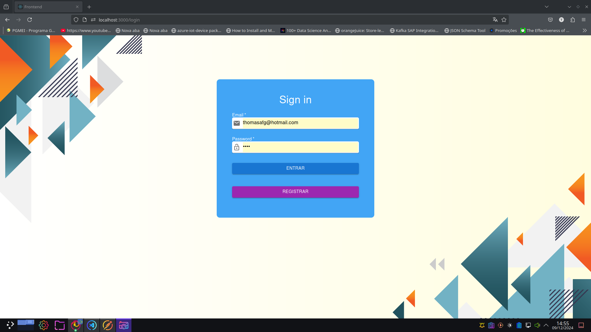
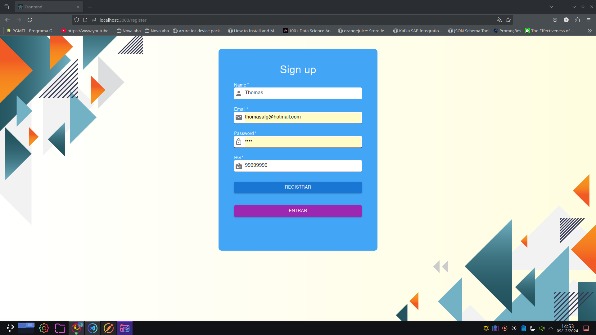
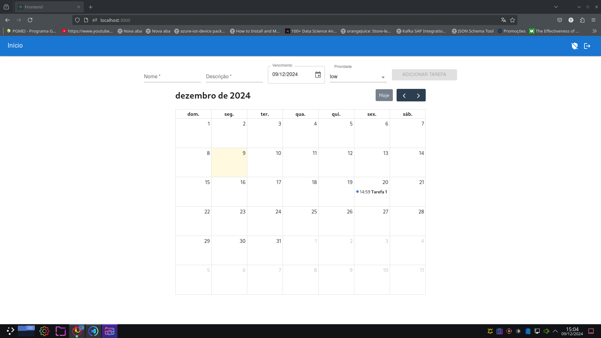

# Gerenciados de Tarefas em node.js

Projeto para Gerenciar tarefas em um calendário.

## 💻 Pré-requisitos

Para testar este projeto é necessário apenas docker. 

## 🚀 Instalação e execução

Para instalar o projeto:

```
sudo docker compose -f "docker-compose.yml" up -d --build
```

Este arquivo irá criar um banco de dados Postgres, um servidor de cache com Redis, um Backend em NodeJS para a aplicação e um Frontend em React para interação.

A documentação do Backend poderá ser encontrada em http://localhost:5000/docs e a aplicação será acessada por http://localhost:3000/

## 🔐 Login e registro

Ao acessar http://localhost:3000/ será redirecionado para a tela de login onde há um link também para a tela de registro. Para fins de teste apenas foi feita a validação se os dados não estão vazios.





## 📆 Dashboard

A Dashboard possui uma barra superior com um botão ícone de sair no canto superior direito e um botão ícone para alternar se usuário é administrador ou não. Este botão foi adicionado para testar a regra de roles do Backend e somente usuários administradores podem adicionar tarefas.



Abaixo na dashboard há um formulário para adicionar tarefa que só é visivel se usuário for adiministrador e um calendário com as tarefas na sua data de vencimento. Ao clicar em uma tarefa um pequeno modal aparece com as informações da tarefa e no qual é possível marcar a tarefa como concluída e/ou deletá-la.

## ⚠️ Observação

Não foi possível implementar as seguintes ferramentas devido ao tempo:

- Websocket para atualização em tempo real
- Testes unitários utilizando o Jest
- Validações de datas e outros campos